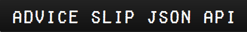
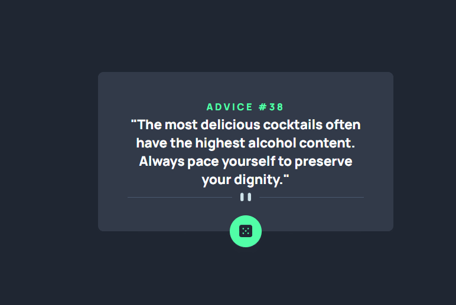

# 💻 Challenge Frontend Mentor

<h1 align="center">
  
<h1>

This is the solution to the challenge [Advice generator app](https://www.frontendmentor.io/challenges/advice-generator-app-QdUG-13db/hub).

##  🧵 Índice

  - [Screenshot](#📷-screenshot)
  - [Links](#🖇-links)
  - [How to Contribute](#♻-how-to-contribute)
  - [Built With](#🛠-built-with)
  - [What I've learned](#📝-what-ive-learned)
  - [Autor](#🙋🏻‍♂️-autor) 

### 📷 Screenshots
<div style="display:flex">
  
</div>


### 🖇 Links

- [URL do desafio](https://www.frontendmentor.io/challenges/advice-generator-app-QdUG-13db/hub)
- [URL Solução](https://monsor3s.github.io/advice-generator-app/)

## ♻ How to Contribute
```bash
  # Clone the project
  $ git clone https://github.com/monsor3s/advice-generator-app.git
```
```bash
  # Enter directory
  $ cd advice-generator-app
```
```bash
  # Install the dependencies, if use npm
  $ npm install
  $ npm install -D sass
```
```bash
  # Install the dependencies, if use yarn
  $ yarn install
  $ npm install -D sass
```
### 🛠 Built With

- [Flexbox](https://developer.mozilla.org/pt-BR/docs/Learn/CSS/CSS_layout/Flexbox)
- [Design Responsive](https://developer.mozilla.org/pt-BR/docs/Learn/CSS/CSS_layout/Responsive_Design)
- [SASS](https://sass-lang.com/) - For styles
- [ViteJS](https://vitejs.dev/guide/)
- [React](https://reactjs.org/)
- [Advice Slip JSON API](https://api.adviceslip.com/)


### 📝 What I've learned

- The consumption of API in react

##  🙋🏻‍♂️ Autor

- Linkedln - [@Linkedln](https://www.linkedin.com/in/marlon-monsores-380408b2/)
- Frontend Mentor - [@monsor3s](https://www.frontendmentor.io/profile/monsor3s)
